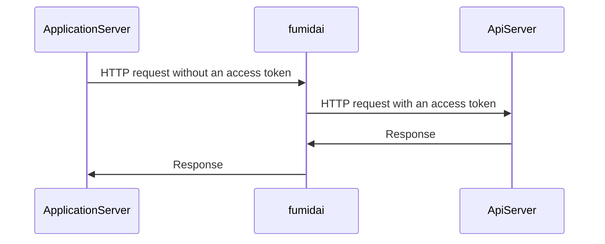

# fumidai

A stepping-stone server that provides APIs while hiding access tokens.

By accessing the API via fumidai, each server does not need to know the access token.

However, **it is not recommended to expose this server to outside client.**

## Usage

|  Option  |  Description  |
| ---- | ---- |
|  -H  |  Specifies request headers to be added. (can be used multiple times) |
|  -X  |  Specify the method: GET,POST,PUT,DELETE  |
|  -port  |  listen port (default 8080) |

## Example

[Open AI API Example](https://github.com/kurehajime/fumidai/tree/main/sample/openai)
